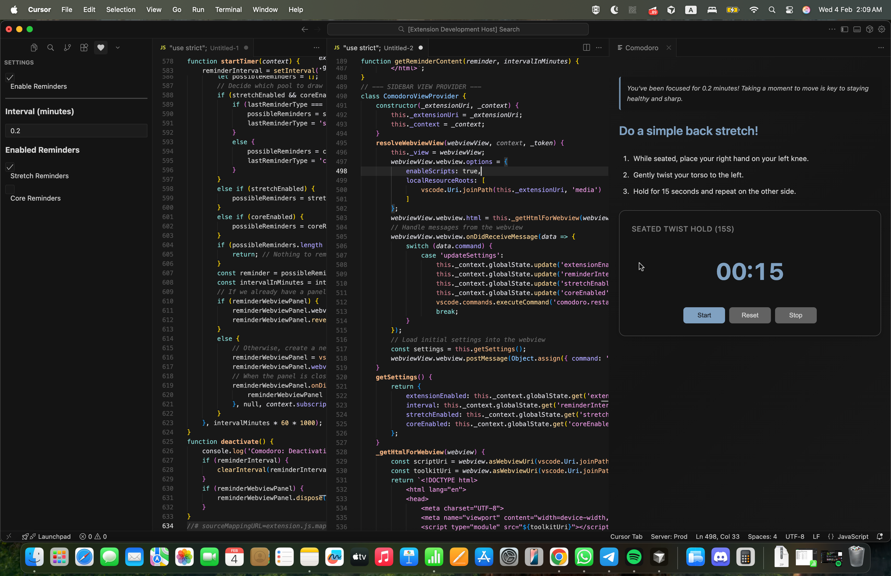

# Wellness Reminder for VS Code

A simple, configurable extension to remind you to take breaks and care for your physical health while you code.

## Why?

As developers, we often spend long hours sitting in front of the computer. Taking short, regular breaks to stretch and move is crucial for maintaining long-term health, preventing repetitive strain injury (RSI), and improving focus. This extension provides a gentle, non-intrusive nudge to do just that.

## Features

- **Gentle Reminders**: A notification will pop up to remind you to take a break.
- **Simple Exercises**: Clear, step-by-step instructions for quick stretches and core exercises you can do at your desk.
- **Fully Configurable**: Use the sidebar to control everything.
- **Master Toggle**: Easily enable or disable all reminders with a single click.
- **Custom Interval**: Set your preferred reminder interval in seconds.
- **Choose Your Focus**: Select which type of reminders (Stretches, Core Exercises) you want to receive.

## How to Use

1.  After installing, you will see a new **Heart Icon** in your VS Code Activity Bar (the bar on the far left).
2.  Click the heart icon to open the **Wellness Reminder settings panel**.
3.  Use the checkboxes and input field to configure the extension to your liking.
4.  Your settings are saved automatically and will apply instantly.

---

*This README was generated with the help of an AI assistant.*
